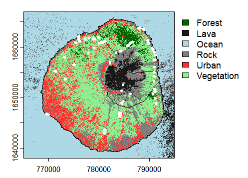
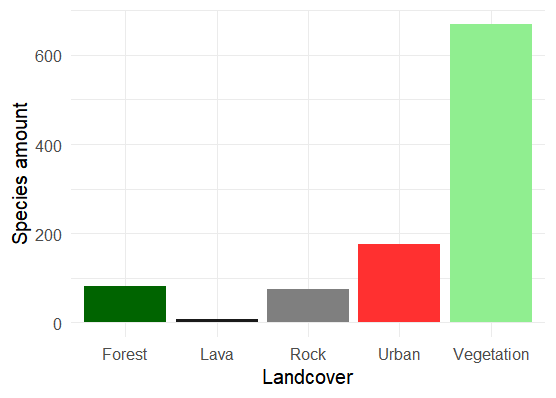

# Landcover Classification via Sentinel-2 Multispectral Imagery

## 🛰️ Project Overview
This project was developed during the GeoTraining Summer School 2024 (Frankfurt, Germany). 
It provides a robust, reproducible workflow for automated landcover classification using Sentinel-2 satellite data. 
The pipeline integrates traditional remote sensing indices with machine learning to achieve high-accuracy environmental mapping.
The second part of the project assess if there any difference in terms of amount of introduced species among classified land covers.

## 🛠️ Technical Workflow
The classification process follows a rigorous geospatial data science pipeline:

1. **Data Acquisition & Preprocessing**: Sourcing of multispectral Sentinel-2 imagery.
    * Atmospheric correction and cloud masking.
    
2. **Feature Engineering**:
    * Derivation of the Normalized Difference Vegetation Index (NDVI) to enhance the spectral separation between vegetated and non-vegetated surfaces.
    * Integration of NDVI as a primary covariate in addition to bands from two Sentinel-2 scenes (May and June) in the modeling process.  
    
3. **Reference Data Creation**:
    * High-resolution ground-truth labeling performed via QGIS using Google Satellite Imagery as a reference layer.
    
4. **Machine Learning Implementation**:
    * Algorithm: Random Forest (RF).
    * Validation Strategy: 5-fold Cross-Validation (CV) to ensure model generalizability and prevent overfitting.
    * Performance Metrics: Calculation of Overall Accuracy, Precision, Recall, and Producer’s/User’s accuracy (Confusion Matrix).

## 🧰 Tech Stack
* Language: R 4.4.1
* Core Libraries: `terra`, `randomForest`, `caret`, `dplyr` and `ggplot2`.
* GIS Software: QGIS

## 📊 Key Results

The model successfully distinguished between Forest, Vegetation, Urban, Water, Rock and Lava with an overall accuracy of 91.5%.

The statistical analysis revealed that there is significant difference in terms of amount of invasive species among land cover classes.

## 💾 Data Notes: Satellite Imagery Acquisition
The raw Sentinel-2 multispectral scenes utilized for this classification (dated 2023-05-01 and 2022-11-27) are not hosted in this repository due to file size constraints. 
They can be retrieved via the Copernicus Data Space Ecosystem or Google Earth Engine using the following parameters:

* Product Type: S2MSI2A (Level-2A Bottom-of-Atmosphere reflectance)

* Sensing Dates: 2023-05-01 and 2022-11-27

* AOI: Fogo Island (Cabo Verde)

## 👥 Team & Credits
Developed as a collaborative project during the GeoTraining 2024.

* Team Lead: SODE A. Idelphonse 

* Collaborators: Olajide A.Y., Nakhwala L., Opara A., Opoku M., Barasa C.W.